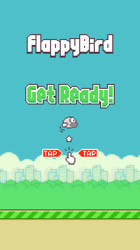

<h1 align="center">
    
</h1>

Clone do Flappy Bird com pygame.

<h4 align="center"> 
	- Status: ✅ -
</h4>

### 🐍 Sobre
---

Este é um clone do famoso jogo FlappyBird, feito inteiramente no python com o pygame.

### 🔋 Tecnologias
---

- [Pygame](https://www.pygame.org/news)

### 🎲 Feito por
---

<a href="https://github.com/LeonardoLuize">
 
  
 <b>Leonardo Luize</b></a> <a href="https://github.com/LeonardoLuize" >💻</a>

Feito por Leonardo Luize 😁

 

